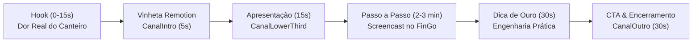

# Kit Oficial de Produção — Canal FinGo (YouTube)

> **Regra Sagrada de Marca:** O logotipo oficial FinGo é **imutável**. Nunca utilizar variações geradas por IA ou aproximações visuais. Todas as peças audiovisuais utilizam exclusivamente os assets vetoriais e bitmaps de alta definição originais (`fingo-logo-full.png`, `fingo-symbol.png`, `fingo-wordmark.png`, `fingo-tagline.png`).

---

## 1. Visão Geral do Kit do Canal

Este kit foi desenvolvido com base no **FinGo Brand System** (estética Brutalist Tech Industrial Dark com verde ácido `#C6FF00`, roxo `#7F49B8`, fundos ink `#0D0D0D` e tipografia Monument Grotesk).

O kit é composto por:
1. **Vinhetas & Animações com Remotion (React Programático em 4K/1080p):**
   - **`CanalIntro`**: Abertura oficial cinematográfica de 5 segundos com travamento cinético do logo e HUD técnico.
   - **`CanalOutro`**: Encerramento oficial de 6 segundos com layout preparado para End Screens do YouTube (Vídeo Recomendado + Inscreva-se + link `fingo.api.br`).
   - **`CanalLowerThird`**: Crachá animado de 5 segundos no canto inferior esquerdo com o ícone oficial FinGo, nome do apresentador e tema do episódio.
   - **`CanalThumbnail`**: Gerador programático de thumbnails em Full HD (1920x1080) com o logotipo oficial 100% fiel e tipografia massiva de alto clique.

2. **Roteiros Detalhados de Produção (Scripts Prontos para Gravação):**
   - **Episódio 01**: *"Do Terreno ao Lucro: Como Cadastrar Obras e Fechar Medições Caixa sem Atraso"* (`canal/roteiros/01-inicio-obra-e-medicoes-caixa.md`)
   - **Episódio 02**: *"Fim da Planilha Bagunçada: Gestão de Caixa e Conciliação Bancária OFX Automática"* (`canal/roteiros/02-gestao-caixa-e-conciliacao-ofx.md`)
   - **Episódio 03**: *"Orçamento SINAPI Descomplicado: BDI Caixa e Propostas em 5 Minutos"* (`canal/roteiros/03-orcamento-sinapi-e-bdi.md`)
   - **Episódio 04**: *"BIM 3D no Celular e Clash Detection no Canteiro de Obras"* (`canal/roteiros/04-bim-3d-e-clash-detection.md`)

---

## 2. Como Renderizar as Vinhetas e Thumbnails no Remotion

Dentro do diretório `remotion/`:

```bash
# 1. Abrir o Remotion Studio no navegador para pré-visualização interativa
cd remotion
npm run studio

# 2. Renderizar a Vinheta de Abertura (CanalIntro - 1920x1080 MP4)
npm run render:canal-intro

# 3. Renderizar a Vinheta de Encerramento (CanalOutro - 1920x1080 MP4)
npm run render:canal-outro

# 4. Renderizar o Lower Third com transparência (CanalLowerThird - 1920x1080 MP4)
npm run render:canal-lowerthird

# 5. Renderizar Thumbnail oficial em alta resolução (CanalThumbnail - PNG 1920x1080)
npm run render:canal-thumb
```

---

## 3. Estrutura dos Roteiros de Vídeo

Cada episódio segue uma metodologia testada de alta retenção no YouTube para o nicho de construção civil e SaaS:



1. **Hook (0:00 - 0:15):** Apresentação imediata da dor (glosa da Caixa, erro de BDI, retrabalho de viga concretada, planilha corrompida).
2. **Vinheta Oficial (0:15 - 0:20):** Impacto visual com `CanalIntro`.
3. **Apresentação (0:20 - 0:35):** Apresentador na câmera com `CanalLowerThird` informando nome e tema.
4. **Screencast Passo a Passo (0:35 - 03:30):** Demonstração sem enrolação no software real com os cliques e regras.
5. **Dica de Ouro da Engenharia (03:30 - 04:00):** Insight prático de canteiro que gera valor além do software.
6. **CTA & Encerramento (04:00 - 04:30):** Chamada para testar em `fingo.api.br` e `CanalOutro`.
