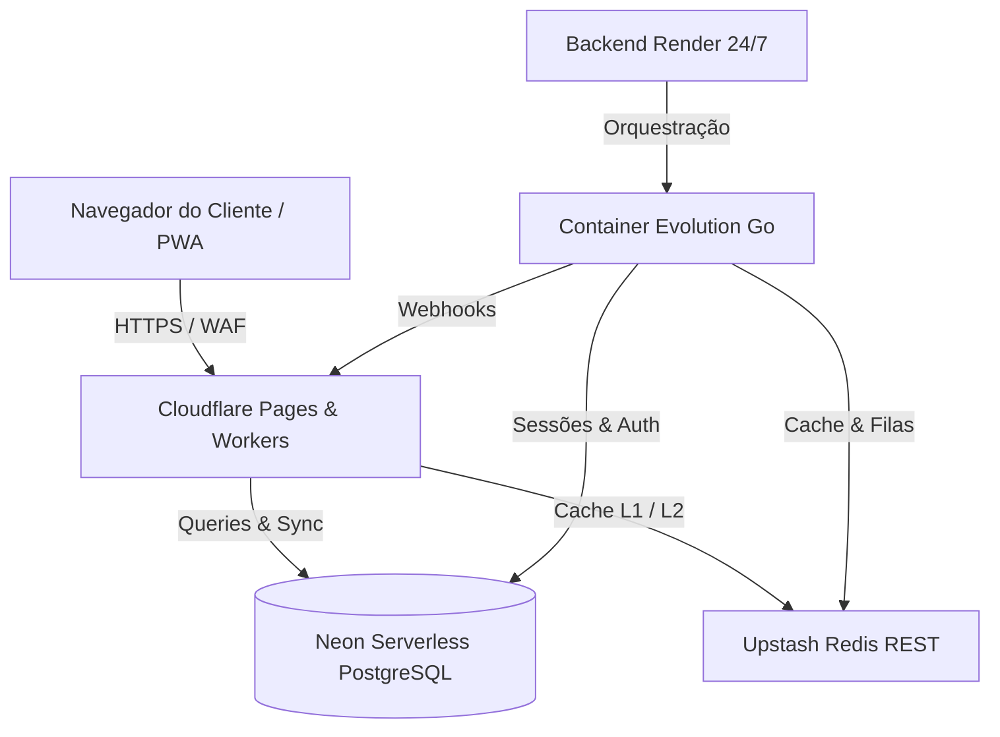

# Arquitetura do Sistema

O FinGo foi modelado para balancear **alta velocidade de desenvolvimento**, **performance de borda (<10ms)** e **isolamento estrito multi-tenant**.

---

## 🏛️ Topologia de Três Camadas

---

## 🧩 Bounded Contexts do Monólito Modular

1. **Atendimento & Notificações (`/whatsapp`):**
   - Gestão de sessões por tenant.
   - Envio automático de relatórios, cobranças e alertas de vencimento.

2. **Engenharia & Obras (`/obras`):**
   - Diário de Obras, Boletim de Medição e Curva S.
   - Cronograma físico-financeiro com índice SPI/CPI.

3. **Orçamentação Técnica (`/sinapi`):**
   - Catálogo oficial da Caixa Econômica Federal.
   - Cálculo automático de BDI conforme acórdão do TCU e Leis Sociais.

4. **Financeiro & Conciliação (`/financeiro`):**
   - Lançamentos de despesas e receitas por centro de custo de obra.
   - Importação e conciliação bancária via OFX e PIX.
