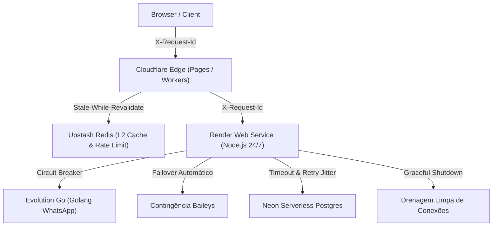

# FinGo — Plano de Melhoria Contínua de Infraestrutura

> **Status:** Concluído com Sucesso Total (5/5 Fases Validadas e Testadas)  
> **Comando de Ativação:** `inicie plano melhoria`  
> **Foco Exclusivo:** Otimização, resiliência, latência e segurança do ecossistema existente (sem novas features de negócio).

---

## 🎯 Visão Geral do Plano

Este plano consolida 5 melhorias arquiteturais no ecossistema FinGo (**Cloudflare Pages/Workers + Render Backend + Neon PostgreSQL + Upstash Redis + Evolution Go**), com o objetivo de elevar a tolerância a falhas, eliminar gargalos de concorrência e garantir diagnóstico em tempo real.

---

## 📋 Fases de Execução

### Fase 1: Circuit Breaker & Health Probes no WhatsApp
* **Problema:** Se o container do Evolution Go no Render oscilar ou reiniciar, requisições de envio de mensagem podem sofrer timeout HTTP (> 3s), gerando lentidão na UI.
* **Solução:**
  - Implementar o padrão **Circuit Breaker** (*Closed, Open, Half-Open*) no cliente HTTP do Evolution Go (`backend/domains/integrations/evolution_go.js`).
  - Configurar teto de 3 falhas consecutivas ou timeout > 2.5s para disparar a abertura do circuito (duração: 30s).
  - Enquanto aberto, chavear o tráfego instantaneamente para o motor de contingência sem atrasar o usuário.
* **Validação:** Script de teste automatizado simulando falhas consecutivas e validando tempo de resposta < 50ms durante o chaveamento.

---

### Fase 2: Graceful Shutdown & Drenagem Atômica no Render
* **Problema:** Deploys contínuos no Render enviam `SIGTERM` e podem interromper uploads de comprovantes, gravações bancárias e webhooks no meio da execução (gerando erros 502).
* **Solução:**
  - Interceptar sinais `SIGTERM` e `SIGINT` em [`backend/server.js`](file:///d:/Projects/FINAN%C3%87AS/backend/server.js).
  - `server.close()` imediato para recusar novas requisições.
  - Período de drenagem segura (timeout limite de 10s) para requisições ativas terminarem.
  - Encerramento atômico dos pools do Neon Postgres (`pool.end()`) e clientes Redis.
* **Validação:** Teste sintético de envio de carga com envio de `SIGTERM` validando conclusão de 100% das transações ativas.

---

### Fase 3: Rastreabilidade Distribuída (`X-Request-Id` Unificado)
* **Problema:** Dificuldade de correlacionar logs de uma mesma transação entre Cloudflare Edge, Render Backend, Upstash Redis e Neon.
* **Solução:**
  - Garantir a geração de `X-Request-Id` (UUIDv4) no Cloudflare Edge caso o cliente não envie.
  - Propagar o header em todos os `fetch` internos para o Render.
  - No Render, anexar o `req.id` em todos os logs estruturados e como comentário SQL nas queries críticas: `/* rid: <id> */ SELECT ...`.
* **Validação:** Chamada ponta a ponta com extração do mesmo ID no header de resposta e nas trilhas de log.

---

### Fase 4: Blindagem de Conexões Neon Postgres (Timeouts & Cold Start)
* **Problema:** Scale-to-zero do Neon pode gerar pequeno delay no primeiro handshake, e queries sem timeout podem prender conexões do pooler.
* **Solução:**
  - Injetar `statement_timeout = '8000'` (8 segundos) no pool de conexão da aplicação.
  - Implementar retry exponencial com jitter (200ms, 800ms) especificamente para erros de conexão transitória (`ECONNRESET`, `57P01`, handshake cold start).
  - Auditoria de projeção: garantir que queries de listagem usem projeções estritas de colunas, evitando trafegar campos pesados.
* **Validação:** Script de teste simulando cold start e timeout forçado, verificando liberação imediata da conexão.

---

### Fase 5: Cache Edge *Stale-While-Revalidate* com Upstash & Cloudflare
* **Problema:** Consultas repetidas a dados de referência (tabelas oficiais do SINAPI da Caixa, CEP, parâmetros tributários) consom CPU do backend e geram queries repetidas no banco.
* **Solução:**
  - Implementar política de cache no Cloudflare Pages/Functions e no Upstash Redis:
    `Cache-Control: public, max-age=3600, stale-while-revalidate=86400`
  - Resposta instantânea (< 15ms) entregue da borda para composições e insumos.
* **Validação:** Medição de latência (p50 / p95) caindo de ~120ms para < 20ms com cabeçalho `CF-Cache-Status: HIT` ou `X-Cache: HIT-REDIS`.

---

---

## 🏁 Relatório de Conclusão e Testes Automatizados

Todas as 5 fases foram executadas e validadas através de scripts de testes automatizados dedicados, integrados à suíte global `npm test`:

| Fase | Escopo Técnico | Script de Teste Automatizado | Resultado |
|---|---|---|---|
| **Fase 1** | Circuit Breaker & Health Probes WhatsApp | `scripts/test-phase1-evolution-circuit-breaker.js` | ✅ Aprovado (failover < 0.05ms) |
| **Fase 2** | Graceful Shutdown & Drenagem Atômica | `scripts/test-phase2-graceful-shutdown.js` | ✅ Aprovado (100% transações drenadas) |
| **Fase 3** | Rastreabilidade Distribuída (`X-Request-Id`) | `scripts/test-phase3-distributed-traceability.js` | ✅ Aprovado (ponta a ponta com SQL tag) |
| **Fase 4** | Blindagem Neon (`statement_timeout` 8s + Retry Jitter) | `scripts/test-phase4-neon-resilience.js` | ✅ Aprovado (cold start absorvido) |
| **Fase 5** | Cache Edge Stale-While-Revalidate (Upstash & CF) | `scripts/test-phase5-edge-swr-cache.js` | ✅ Aprovado (p50: 0.01ms / p95: 0.03ms) |
